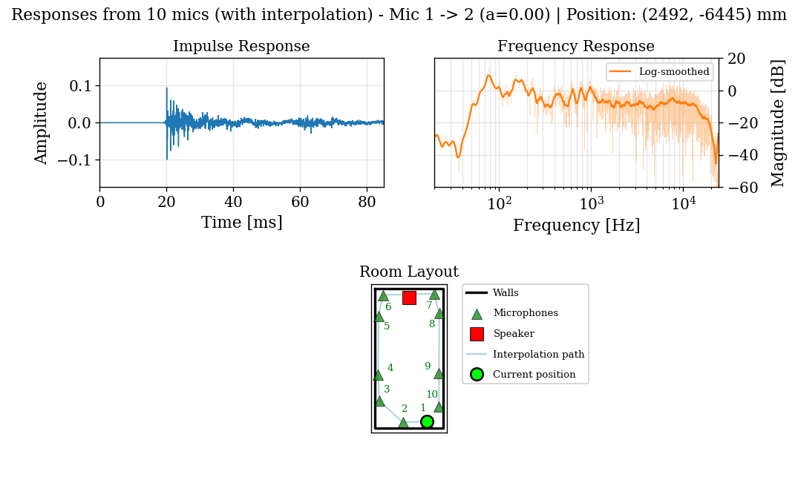

# **A DDSP Framework for Adaptive Room Equalization**
### Additional material for *29th International Conference on Digital Audio Effects 2026 (DAFx26)*

> **Paper:** [link to PDF]  
> **Code:** [link to repository]  
> **Audio demos:** [link to audio folder or GitHub Pages section]  
> **Contact:** [your email / lab / handle]

---

<!-- Framework block diagram -->

  

**Figure 1.** Example of the proposed adaptive room EQ framework. A parametric EQ continuously adapts to "flatten" the frequency response of a time-varying room/soundsystem response. The excitation signal is a music track and the corrections are performed using the iHAM-1 method and a frequency-domain loss.

## Overview

This page supports the paper by providing a longer-form summary, a compact explanation of the proposed framework, visual material, controlled examples of the adaptive behavior, and reproducible audio demonstrations.

The paper presents a modular DDSP-based framework for adaptive room equalization (ARE) that unifies classical adaptive filtering and differentiable audio optimization in a single closed-loop setting. In the manuscript, the framework is organized around four interchangeable components: the equalizer (EQ) structure, the response-estimation method, the loss function, and the optimizer. A key theoretical point is that the classical Fx-LMS algorithm appears as a special case under standard assumptions. The experiments further show that frequency-domain losses are more stable than time-domain losses in the considered nonstationary musical excitation scenarios, and that reliable online response estimation is very important for stable adaptation.

## Extended summary

Adaptive room equalization (ARE) aims to compensate time-varying acoustic coloration so that playback matches a target response even when the sound system response, room conditions or listener position changes. In the paper, this is cast as a closed-loop control problem: audio is processed in frames, the current equalized output is measured, a loss is computed against a target response, and the equalizer parameters are updated online.

The main contribution is a differentiable and modular formulation that keeps the signal chain explicit and flexible. This makes it easy to swap equalizer structures, response estimators, losses, and optimizers without changing the overall loop. The implemented experiments are not intended as a final deployed room-equalization product, but as an open and reproducible basis for exploring the relationship between classical adaptive filtering and DDSP-style optimization. The corresponding *PyTorch* source code is provided in the accompanying repository (LINK) so that the framework can be further inspected and modified.

Empirically, the paper reports that frequency-domain objectives are better suited to the tested musical and time-varying scenarios than time-domain MSE, and that structured parametric equalization can outperform long FIR baselines (Fx-LMS, Fx-FDAF) under the same experimental conditions. The manuscript also reports that frame length, response-estimation quality, and optimizer choice create a meaningful trade-off between responsiveness, stability, and compute cost.

## Limitations and future work

The paper evaluates the framework in controlled simulations based on measured room impulse responses, so the reported results should be interpreted within that scope. We highlight that real-world deployment factors such as crowd noise, loudspeaker/device nonlinearity, converter quantization, thermal drift, and uncontrolled listener movement are not yet covered. Future work should assess robustness in those conditions, as well as in the occurrence of low-information frames and further study real-time deployment with optimized implementations of higher-order update rules and accounting for I/O latency.

## Conclusions

The proposed framework establishes a principled link between classical Fx-LMS and differentiable audio optimization in a closed-loop adaptive room-equalization setting. The conducted tests conclude that frequency-domain losses are more appropriate than time-domain MSE for the tested nonstationary conditions, that accurate online response estimation is essential for stable adaptation, and that the proposed modular implementation provides a flexible basis for future algorithmic development.

---

# Proposed framework

## Conceptual overview

The diagram below should summarize the full closed-loop pipeline: input frame, parametric EQ, loudspeaker-enclosure-microphone (LEM) path, online response estimation, target response, differentiable loss, and optimizer update.

<!-- Framework block diagram -->

  

**Figure 2.** Block diagram of the proposed adaptive room equalization system. The LEM block stands for loudspeaker-enclosure-microphone, although the linear response of other elements in the sound system (e.g., amplifiers, transmission lines, crossover filters) is also included in $\mathbf{s}_k$.

This framework casts the ARE task as a frame-wise closed-loop controller. The input signal is segmented into non-overlapping frames, passed through a parametric equalizer, propagated through the room/soundsystem response, measured, compared to a target response, and used to update the equalizer parameters once per frame. The frame-length rises as a fundamental trade-off in our work, balancing between update rate and spectral resolution. In an ablation study, the size of 8192 samples is chosen as the best compromise and is used throughout. All of the experiments can be re-run with different step sizes in the repository (LINK).

## Notation

The following notation is used throughout the paper

- $u_k$: input frame at time index $k$
- $x_k$: equalizer output
- $s_k$: time-varying room / LEM response
- $y_k$: measured output at the capture device
- $y_k^\*$: target output
- $\bar{\theta}_k$: equalizer parameter vector
- $H_{\mathrm{EQ}}(e^{j\omega}; \bar{\theta})$: parametric equalizer frequency response
- $H^\*(e^{j\omega})$: target response
- $L(\cdot)$: differentiable loss
- $\Delta \bar{\theta}_k$: parameter update
- $N$: frame length (samples)
- $M$: number of biquads of parametric EQ
- $G$: global EQ gain (dB)

## Time-varying acoustic scenarios
<!-- Scenarios animations -->

  

**Figure 3.** Animation depicting the simulated moving listener scenario. With a fixed speaker position, the position of the listener is changed smoothly via interpolation of the measured frequency responses (SoundCam dataset - conference room). This results in large yet realistic structural changes in the acoustic response. Because of this, this is treated in the analysis as the wrost case scenario---when also dealing with (nonstationary) musical excitation signals.

  

**Figure 4.** Animation depicting the simulated moving person scenario. With a fixed loudspeaker and listener position, the position of a person within the room is varied smoothly via interpolation. This results in slight changes in the acoustic response, although representative of the real effect of a moving human within the conference room (SoundCam dataset).